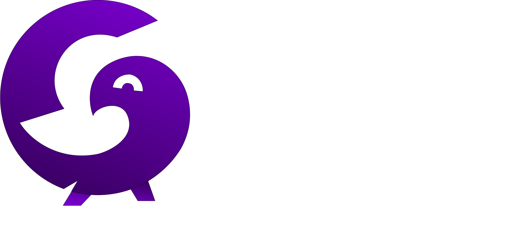

# 

## What even is this?

Honestly? We're not entirely sure anymore. It started as a social media thing, then someone added chat, then we got carried away with wallets and marketplaces and... yeah. It's a lot.

Think Twitter meets Discord meets your bank account meets that one app you downloaded once and immediately forgot about. Except this time with more features and questionable life choices.

## Features (we think)

- 📱 **Feed** - Post stuff. Read stuff. Ignore stuff. The usual.
- 💬 **Chat** - DM people. Join rooms. Pretend to be productive.
- 🏆 **Leaderboard** - Because everything needs to be competitive, apparently.
- 🛒 **Marketplace** - Buy things? Sell things? We're still figuring this out.
- 💰 **Wallet** - For when you want to feel like a crypto bro without the commitment.
- 📊 **Activities** - Watch everyone else be more active than you.
- 💡 **Suggestions** - Let us tell you what to do with your life.

## Tech Stack (for the nerds)

- **Next.js 16** - The latest and greatest (probably has bugs we haven't found yet)
- **React 19** - Because we like living dangerously
- **TypeScript** - Types? We'll add those later (maybe)
- **Tailwind CSS 4** - Utility classes go brrrr
- **Framer Motion** - Making things bounce unnecessarily since forever
- **Redux Toolkit** - Global state management (or over-engineering, you decide)
- **Radix UI** - Pre-built components so we don't have to think
- **Lottie** - For those fancy animations nobody asked for
- **Globe.gl** - Because every app needs a 3D globe, obviously
- **Emoji Picker** - 🎉 Essential infrastructure 🚀
- **date-fns** - Math is hard
- A concerning amount of custom CSS we refuse to delete

## Contributing

Sure, why not? Open a PR. We'll probably merge it after forgetting about it for 3 months.

## Things We Definitely Need to Fix

- [ ] Everything
- [ ] That one bug in production
- [ ] The other bug in production
- [ ] Make it actually work on Internet Explorer (jk lol)
- [ ] Figure out what half these files do
- [ ] Comment the code (maybe)
- [ ] Update this README (probably never)

## Dark Mode

Yes, we have it. Yes, it works (mostly). Yes, there's a fancy toggle with stars and clouds because we spent way too much time on that.

## Mobile Support

It works on mobile! We think. We tested it once. On one phone. In portrait mode.

## FAQ

**Q: Is this production-ready?**  
A: Define "ready"

**Q: Can I use this for my project?**  
A: You're braver than I thought

**Q: Why did you build this?**  
A: Bold of you to assume we had a reason

**Q: The code doesn't make sense**  
A: That's not a question but yeah, we know

## License

MIT or whatever. Do what you want. We're not your mom.

## Credits

Built with ❤️ and an unhealthy amount of ☕

Special thanks to Stack Overflow, ChatGPT, and that one random blog post from 2015 that somehow solved everything.

---

*"It's not a bug, it's a feature"* - Us, probably
